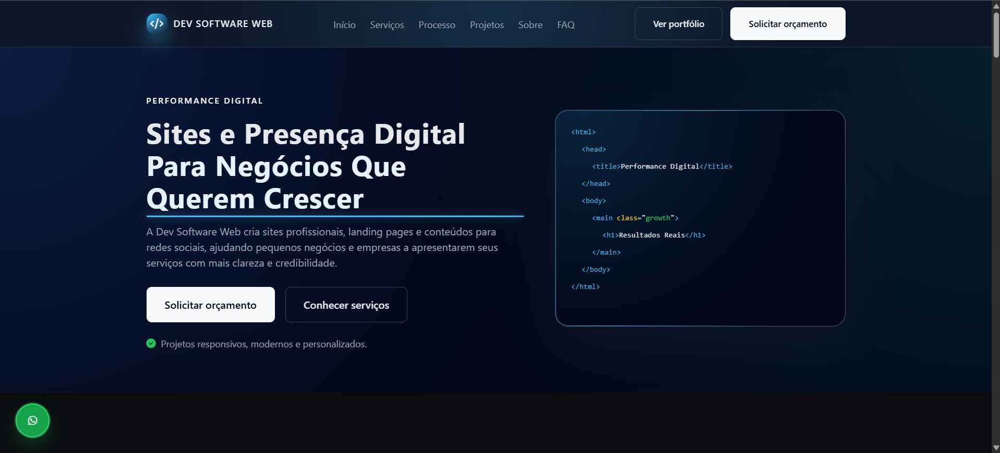

# Dev Software Web



Landing page profissional da **Dev Software Web**, uma marca de serviços digitais e assessoria acadêmica administrada por Diego Francisco da Silva.

O projeto apresenta serviços de desenvolvimento Front-End, criação de sites, landing pages, reformulação de redes sociais e produção de conteúdos digitais para pequenos negócios, profissionais autônomos e empresas. Também divulga serviços de assessoria acadêmica para estudantes do ensino fundamental, ensino médio, cursos técnicos, graduação e pós-graduação.

## Demonstração

Acesse o projeto publicado:

[Dev Software Web — Landing Page](https://diegofranciscodasilva.github.io/dev-software-web/)

## Portfólio do desenvolvedor

[Diego Francisco da Silva — Portfólio](https://diegofranciscodasilva.github.io/DiegoPortfolio/)

## Objetivo do projeto

Criar uma landing page comercial para:

- Apresentar a marca Dev Software Web;
- Divulgar serviços digitais;
- Divulgar serviços de assessoria acadêmica;
- Mostrar projetos demonstrativos;
- Explicar o processo de atendimento;
- Apresentar pacotes de serviços;
- Gerar contatos e pedidos de orçamento;
- Direcionar visitantes para o WhatsApp, Instagram e formulário de briefing.

## Serviços apresentados

A landing page apresenta os seguintes serviços:

- Criação de sites;
- Criação de landing pages;
- Reformulação de Instagram;
- Reformulação de Facebook;
- Criação de posts;
- Criação de carrosséis;
- Criação de Reels;
- Criação de banners e materiais digitais;
- Organização da presença digital;
- Manutenção e atualização de projetos.

### Assessoria acadêmica

- Trabalhos escolares e acadêmicos;
- Trabalhos de faculdade;
- Resumos e fichamentos;
- Pesquisas e revisões bibliográficas;
- Apresentações de slides;
- Projetos acadêmicos;
- Artigos científicos e TCCs;
- Estruturação, revisão e formatação conforme normas ABNT;
- Roteiros para apresentação oral;
- Correção de textos e melhoria da escrita.

O atendimento é divulgado como assessoria, orientação, pesquisa assistida, revisão e formatação. O trabalho respeita a autoria do estudante e as regras da instituição de ensino, sem oferecer produção clandestina de trabalhos prontos para entrega.

## Tecnologias utilizadas

- HTML5;
- CSS3;
- JavaScript;
- Font Awesome;
- Git;
- GitHub;
- GitHub Pages.

## Recursos da interface

- Layout responsivo;
- Navegação por âncoras;
- Menu para dispositivos móveis;
- Tema escuro;
- Seção de serviços;
- Seção de projetos;
- Seção de processo;
- Cards de diferenciais;
- Cards de pacotes;
- FAQ interativo;
- Botões de chamada para ação;
- Links para redes sociais;
- Botões flutuantes para WhatsApp e retorno ao topo;
- Integração com WhatsApp;
- Integração com formulário Tally;
- Ícones da biblioteca Font Awesome;
- Animações e transições suaves.

## Estrutura da página

A landing page está organizada nas seguintes seções:

1. Header;
2. Hero;
3. Serviços;
4. Desafios da presença digital;
5. Solução Dev Software Web;
6. Processo de trabalho;
7. Projetos;
8. Sobre a marca;
9. Diferenciais;
10. Pacotes;
11. Compromisso com cada projeto;
12. Dúvidas frequentes;
13. Chamada para ação;
14. Footer.

## Estrutura de arquivos

```text
dev-software-web/
├── index.html
├── assets/
│   │   ├── css/
│   │   └── style.css
│   ├── images/
│   └── js/
│       └── script.js
└── README.md
```

## Processo de criação

O projeto foi desenvolvido seguindo este fluxo:

1. Definição do posicionamento da marca;
2. Planejamento das seções da landing page;
3. Criação da identidade visual;
4. Definição da paleta de cores;
5. Desenvolvimento da estrutura HTML;
6. Criação dos estilos em CSS;
7. Implementação das interações com JavaScript;
8. Adição dos ícones com Font Awesome;
9. Testes de responsividade;
10. Publicação no GitHub Pages.

## Identidade visual

A interface utiliza uma estética tecnológica, moderna e profissional.

### Cores principais

- `#0B0B0F` — Fundo principal;
- `#020617` — Fundo elevado e seções de destaque;
- `#111827` — Fundo dos cards;
- `#E5E7EB` — Texto principal;
- `#9CA3AF` — Texto secundário;
- `#38BDF8` — Cor de destaque e hover;
- `#22C55E` — Indicadores de sucesso;
- `#DC2626` — Indicadores de erro.

## Responsividade

A interface foi planejada para diferentes tamanhos de tela:

- Smartphones;
- Tablets;
- Notebooks;
- Desktops.

Os principais pontos testados incluem:

- Menu mobile;
- Organização dos cards;
- Leitura dos textos;
- Tamanho dos botões;
- Espaçamento entre seções;
- Navegação por âncoras;
- Ajuste das colunas;
- Exibição dos projetos.

## Acessibilidade

O projeto utiliza práticas básicas de acessibilidade, como:

- HTML semântico;
- Hierarquia de títulos;
- Botões identificados;
- Links com textos descritivos;
- Contraste entre texto e fundo;
- Estados de foco;
- Navegação organizada;
- Ícones acompanhados de textos quando necessário.

## Melhorias futuras

Possíveis melhorias para versões futuras:

- Adicionar imagens reais dos projetos;
- Criar páginas individuais para cada projeto;
- Integrar o formulário Tally diretamente;
- Adicionar domínio personalizado;
- Melhorar SEO;
- Criar página de política de privacidade;
- Adicionar formulário de contato próprio;
- Integrar Google Analytics;
- Integrar Google Search Console;
- Criar área de depoimentos reais;
- Adicionar planos de manutenção;
- Otimizar imagens para melhorar o desempenho.

## Observações comerciais

A Dev Software Web é uma marca de prestação de serviços digitais administrada por Diego Francisco da Silva.

Os serviços podem incluir:

- Desenvolvimento de sites;
- Criação de landing pages;
- Reformulação de redes sociais;
- Criação de posts e carrosséis;
- Criação de Reels e materiais digitais;
- Atualizações e manutenção.

Alterações, novas páginas, correções fora do escopo original e manutenção após a entrega devem ser tratados mediante novo orçamento ou contratação específica.

## Autor

### Diego Francisco da Silva

Estudante de Engenharia de Software e desenvolvedor Front-End freelancer.

### Links

- [Portfólio](https://diegofranciscodasilva.github.io/DiegoPortfolio/)
- [GitHub](https://github.com/diegofranciscodasilva)
- [LinkedIn](https://www.linkedin.com/in/diego-francisco-da-silva/)
- [Instagram](https://www.instagram.com/dev.software.web/)

## Licença

Este projeto foi desenvolvido para fins de apresentação profissional, estudo e divulgação dos serviços da Dev Software Web.

O código pode ser consultado para fins educacionais. A identidade visual, textos, marca e materiais da Dev Software Web não devem ser utilizados comercialmente sem autorização.
